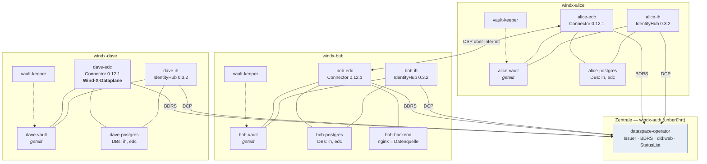

# Referenz: tractusx-edc Deployment je Teilnehmer

> **Nur einen Teilnehmer aufsetzen? → [QUICKSTART.md](QUICKSTART.md)** (zum Kopieren, ~20 Min).
> Dieses Dokument ist die **Referenz**: welcher Chart-Wert auf welche Umgebungsvariable wirkt und
> warum. Zum Nachschlagen, nicht zum Durchklicken.

Nutzt die vollen Charts mit **einem HashiCorp Vault pro Teilnehmer**, geteilt zwischen dem
IdentityHub und dem Connector dieses Teilnehmers. Das vom IH erzeugte STS-Client-Secret und der
DID-Signing-Key landen damit im selben Vault, den der Connector liest — keine manuelle Brücke.

Die zentralen Dienste (`auth-windx.cluster.swms-cloud.com`: Issuer / BDRS / did:web / DCP-Issuance /
Status-Liste) bleiben davon **unberührt**.



Der Vault wird **nur innerhalb eines Teilnehmers** geteilt (dessen IdentityHub + Connector) —
nie über Teilnehmergrenzen hinweg. Die Zentrale hält kein einziges Teilnehmer-Geheimnis.


Alle drei Teilnehmer sind live und tauschen Daten aus. Charlie (ein vierter Teilnehmer auf
vanilla Eclipse EDC) wurde wieder abgebaut — der Namespace `windx-charlie` existiert nicht mehr.

---

## Was sich je Teilnehmer unterscheidet

Alles folgt **einem Muster** mit `<p>` = `alice` | `bob` | `dave`:

| Element | Muster |
|---|---|
| Namespace | `windx-<p>` |
| DID | `did:web:<p>-windx.cluster.swms-cloud.com` |
| IH öffentlich (Wallet + DID) | `<p>-windx.cluster.swms-cloud.com` |
| Connector öffentlich (DSP + Daten) | `<p>-edc-windx.cluster.swms-cloud.com` |
| Vault / Postgres (im Cluster) | `<p>-vault:8200` / `<p>-postgres:5432` |
| IH-Service für STS | `<p>-ih:8087` |
| STS-Client-Secret-Alias | `<did>-sts-client-secret` |
| DID-Signing-Key-Alias | `<did>#signing-key-1` |

Wirklich frei zu wählen ist nur die **BPN**. Der base64-DID ergibt sich daraus
(`echo -n "$DID" | base64`) und wird als URL-Segment der CredentialService-URL gebraucht:

| | Alice | Bob | Dave |
|---|---|---|---|
| BPN | `BPNL00000000WA01` | `BPNL00000000WB02` | `BPNL00000000WD04` |
| DID base64 | `ZGlkOndlYjphbGljZS13aW5keC5jbHVzdGVyLnN3bXMtY2xvdWQuY29t` | `ZGlkOndlYjpib2Itd2luZHguY2x1c3Rlci5zd21zLWNsb3VkLmNvbQ==` | `ZGlkOndlYjpkYXZlLXdpbmR4LmNsdXN0ZXIuc3dtcy1jbG91ZC5jb20=` |
| Besonderheit | – | `bob-backend` (nginx) als Beispiel-Datenquelle | **Wind-X-Dataplane** statt Upstream-Image |

Alles Übrige (Struktur der Wertedateien, DB-Benutzer `edc`/`edc`, ClusterIssuer
`letsencrypt-prod`, IngressClass `nginx`) ist identisch.

### Besonderheit Dave: die Wind-X-Dataplane

Dave ist der einzige Teilnehmer, dessen **Dataplane nicht das Upstream-Image** fährt. Der
Controlplane bleibt unverändert Upstream.

| | Wert |
|---|---|
| Image | `ghcr.io/wind-x-eu/edc-dataplane-windx:windx-on-tractusx-0.12.1` |
| Enthält | offizielle SQL/Vault-Dataplane **plus** `windx-mediator-proxy`, `windx-mms`, `windx-participant-log`, `non-finite-provider-push` |
| Pflicht-Variable | `TX_EDC_WINDX_MEDIATOR_BASE_URL` — **ohne sie bricht der Pod beim Start ab** (kein Default) |
| Pull-Secret | `ghcr-windx` (privates Registry), einmalig je Namespace anlegen |

```bash
kubectl -n windx-dave create secret docker-registry ghcr-windx \
  --docker-server=ghcr.io --docker-username=<gh-user> --docker-password=<PAT read:packages>
```

> In `conn-full-dave.yaml` steht als Tag `latest`; **live läuft `windx-on-tractusx-0.12.1`**.
> Vor einem `helm upgrade` den Tag in der Datei auf den gewünschten Stand setzen, sonst
> schwenkt das Deployment unbeabsichtigt auf `latest`.

## Geheimnisse, die du erzeugen musst

Alle Werte sind inzwischen **rotiert** — die früheren Demo-Defaults (`root`, `password`,
MXD-Standardschlüssel) sind nicht mehr in Benutzung. Je Teilnehmer ein eigener Zufallswert.

| Geheimnis | Woher | Wo es hingehört |
|---|---|---|
| Vault-Token | `openssl rand -hex 16` | `vault-<p>.yaml` (`VAULT_DEV_ROOT_TOKEN_ID`) **und** `vault.hashicorp.token` in beiden Wertedateien |
| Postgres-Benutzer/Passwort | `edc` / `edc` | beide DBs; kein Ingress, nur clusterintern |
| IH-Super-User-Key | `openssl rand -base64 24` | **in den Vault** unter dem Alias `sup3r$3cr3t`, Feld `content` (Schritt 3) |
| Connector-Management-Key | `openssl rand -hex 16` | `controlplane.endpoints.management.authKey` |
| STS-Client-Secret | *vom IH bei der Provisionierung erzeugt* | landet automatisch im Vault; wird nie im Klartext gebraucht |
| DID-Signing-Key | *vom IH erzeugt* (EdDSA/Ed25519) | Vault, Alias `<did>#signing-key-1` |

> Die Dateien unter `deploy/participants/` enthalten bewusst `CHANGE-ME-…`-Platzhalter.
> Echte Werte gehören nicht ins Repository.

---

## Welcher Chart-Wert auf welche Umgebungsvariable wirkt

IdentityHub (`ih-full-<p>.yaml`) → ConfigMap `*-config` / `*-datasource-config`:
- `vault.hashicorp.url` → `edc.vault.hashicorp.url` = `http://<p>-vault:8200`
- `vault.hashicorp.token` → `edc.vault.hashicorp.token` (je Teilnehmer eigener Zufallswert)
- `postgresql.jdbcUrl` / `postgresql.auth.*` → `edc.datasource.*` (db `ih`)
- `identityhub.didweb.https: true` → `edc.iam.did.web.use.https=true`
- `identityhub.endpoints.identity.authKeyAlias: sup3r$3cr3t` → `web.http.identity.auth.alias` (**vault alias**, not a literal key)
- `identityhub.env.EDC_IAM_STS_PRIVATEKEY_ALIAS` / `EDC_IAM_STS_PUBLICKEY_ID` = `<did>#signing-key-1`
- `identityhub.iatp.sts.oauth.client.enabled: false` → `edc.tractusx.ih.participant.configurable.enable=false` (we provision via the Identity API instead)

Connector (`conn-full-<p>.yaml`) → controlplane/dataplane deployment env:
- `iatp.id` → `EDC_PARTICIPANT_ID`, `EDC_IAM_ISSUER_ID`
- `participant.id` → `TRACTUSX_EDC_PARTICIPANT_BPN`; `participant.contextId` → `EDC_PARTICIPANT_CONTEXT_ID`
- `iatp.sts.oauth.token_url` → `EDC_IAM_STS_OAUTH_TOKEN_URL` = `http://<p>-ih:8087/api/sts/token`
- `iatp.sts.oauth.client.id` → `EDC_IAM_STS_OAUTH_CLIENT_ID`
- `iatp.sts.oauth.client.secret_alias` → `EDC_IAM_STS_OAUTH_CLIENT_SECRET_ALIAS` = **`<did>-sts-client-secret`** ← same alias the IH writes
- `iatp.trustedIssuers[0]` → `EDC_IAM_TRUSTED-ISSUER_0-ISSUER_ID` / `_SUPPORTEDTYPES`
- `controlplane.bdrs.server.url` → `TX_EDC_IAM_IATP_BDRS_SERVER_URL` = `https://auth-windx.cluster.swms-cloud.com/api/directory`
- `dataplane.token.signer.privatekey_alias` → `EDC_TRANSFER_PROXY_TOKEN_SIGNER_PRIVATEKEY_ALIAS` = `<did>#signing-key-1`
- `dataplane.token.verifier.publickey_alias` → `EDC_TRANSFER_PROXY_TOKEN_VERIFIER_PUBLICKEY_ALIAS` = `<did>#signing-key-1`
- `vault.hashicorp.*` / `postgresql.*` → same shared vault + db `edc`

---

## Deploy-Reihenfolge (Referenz)

> Die **ausführbare** Fassung mit Variablen steht in [QUICKSTART.md](QUICKSTART.md).
> Hier stehen dieselben Schritte mit Begründung. Beispiel ist Alice; für Bob/Dave die
> `-bob`/`-dave`-Dateien und den passenden Namespace nehmen.

### 0. Voraussetzungen
```bash
helm repo add tractusx-edc https://eclipse-tractusx.github.io/charts/dev
helm repo update
export KUBECONFIG=...   # Cluster mit nginx-Ingress + cert-manager (letsencrypt-prod)
```

### 1. Vault + Postgres (Namespace existiert bereits)
```bash
kubectl -n windx-alice apply -f vault-alice.yaml
kubectl -n windx-alice apply -f postgres-alice.yaml
kubectl -n windx-alice rollout status deploy/alice-vault
kubectl -n windx-alice rollout status deploy/alice-postgres
```

### 2. Super-User-Key der Identity API in den Vault legen
Das volle Chart authentifiziert die Identity API über den Key, der **im Vault** unter
`identityhub.endpoints.identity.authKeyAlias` (`sup3r$3cr3t`) liegt — **nicht** über eine
literale Umgebungsvariable. Der dort abgelegte Wert ist der, den du später als `X-Api-Key`
sendest:
```bash
SUPERUSER_KEY=$(openssl rand -base64 24 | tr -d '\n')   # aufbewahren, wird in Schritt 4 gebraucht
kubectl -n windx-alice exec deploy/alice-vault -- \
  sh -c "VAULT_ADDR=http://127.0.0.1:8200 VAULT_TOKEN=$VAULT_TOKEN \
         vault kv put secret/sup3r\\\$3cr3t content=\"$SUPERUSER_KEY\""
```
> Die hashicorp-vault-Extension liest den Wert aus dem Feld `content` (MXD-Konvention).
> Der frühere MXD-Standardwert `c3VwZXItdXNlcg==.…` ist **rotiert** und nicht mehr gültig.

### 3. IdentityHub (Wallet)
```bash
helm upgrade --install alice-ih tractusx-edc/tractusx-identityhub \
  --version 0.3.2 -n windx-alice -f ih-full-alice.yaml
kubectl -n windx-alice rollout status deploy/alice-ih
```
Prüfen, dass did:web öffentlich und per HTTPS erreichbar ist (cert-manager braucht ggf. eine Minute):
```bash
curl -s https://alice-windx.cluster.swms-cloud.com/.well-known/did.json | jq .
```

### 4. Participant Context + STS-Konto anlegen (Identity API)

> **Bestehenden Teilnehmer wiederherstellen? Diesen Schritt NICHT verwenden.** Er erzeugt einen
> *neuen* Signing-Key und überschreibt den alten privaten Key, der noch im Vault liegt. Stattdessen
> `deploy/participants/ih-provision.yaml` nutzen — der verwendet den vorhandenen Schlüssel weiter,
> der DID bleibt gültig. Siehe [vorfall-2026-08-23-identitaetsverlust.md](vorfall-2026-08-23-identitaetsverlust.md).

This is the MXD `SeedIH → Create Participant` call, adapted to our DIDs/hosts. It:
creates the participant context, **generates the DID signing key** (EdDSA/Ed25519) into the
shared vault at `<did>#signing-key-1`, **creates the STS account** and stores its client
secret in the shared vault at `<did>-sts-client-secret`, and sets the DID-doc service
endpoints (CredentialService + ProtocolEndpoint). **We OMIT credential seeding** — the
MembershipCredential is issued later via our own central DCP flow.

```bash
# reach the internal Identity API (port 8082) via port-forward
kubectl -n windx-alice port-forward svc/alice-ih 8082:8082 &

curl -s -X POST http://localhost:8082/api/identity/v1alpha/participants \
  -H 'Content-Type: application/json' \
  -H "X-Api-Key: $SUPERUSER_KEY" \
  -d '{
    "active": true,
    "did": "did:web:alice-windx.cluster.swms-cloud.com",
    "key": {
      "keyGeneratorParams": { "algorithm": "EdDSA", "curve": "Ed25519" },
      "keyId":           "did:web:alice-windx.cluster.swms-cloud.com#signing-key-1",
      "privateKeyAlias": "did:web:alice-windx.cluster.swms-cloud.com#signing-key-1"
    },
    "participantContextId": "did:web:alice-windx.cluster.swms-cloud.com",
    "serviceEndpoints": [
      {
        "type": "CredentialService",
        "serviceEndpoint": "https://alice-windx.cluster.swms-cloud.com/api/credentials/v1/participants/ZGlkOndlYjphbGljZS13aW5keC5jbHVzdGVyLnN3bXMtY2xvdWQuY29t",
        "id": "credentialservice-1"
      },
      {
        "type": "ProtocolEndpoint",
        "serviceEndpoint": "https://alice-edc-windx.cluster.swms-cloud.com/api/v1/dsp",
        "id": "dsp-url"
      }
    ]
  }'
```
Bob equivalents: DID `did:web:bob-windx.cluster.swms-cloud.com`, base64 segment
`ZGlkOndlYjpib2Itd2luZHguY2x1c3Rlci5zd21zLWNsb3VkLmNvbQ==`, CredentialService host
`bob-windx...`, ProtocolEndpoint `https://bob-edc-windx.cluster.swms-cloud.com/api/v1/dsp`.

> NOTE the endpoint paths vs MXD: connector DSP path in chart 0.12.1 is **`/api/v1/dsp`**
> (MXD used `/api/dsp`), and did:web is **HTTPS**.

### 5. Prüfen, dass STS-Secret und DID-Key im Vault liegen
```bash
kubectl -n windx-alice exec deploy/alice-vault -- \
  sh -c "VAULT_ADDR=http://127.0.0.1:8200 VAULT_TOKEN=$VAULT_TOKEN \
    vault kv get 'secret/did:web:alice-windx.cluster.swms-cloud.com-sts-client-secret'"
kubectl -n windx-alice exec deploy/alice-vault -- \
  sh -c "VAULT_ADDR=http://127.0.0.1:8200 VAULT_TOKEN=$VAULT_TOKEN \
    vault kv get 'secret/did:web:alice-windx.cluster.swms-cloud.com#signing-key-1'"
```
Beide müssen **vor** dem Connector existieren — er liest sie beim Start.

### 6. Connector
```bash
helm upgrade --install alice-edc tractusx-edc/tractusx-connector \
  --version 0.12.1 -n windx-alice --server-side=false -f conn-full-alice.yaml
kubectl -n windx-alice rollout status deploy/alice-edc-controlplane
kubectl -n windx-alice rollout status deploy/alice-edc-dataplane
```

> **`--server-side=false` ist Pflicht.** Chart 0.12.1 rendert die `WEB_HTTP_CATALOG_*`-Variablen
> doppelt. Helm 4 nutzt standardmäßig Server-Side-Apply und bricht daran ab
> (`failed to create typed patch object`); Client-Side-Apply verträgt die Dubletten.
> Das lokale Patchen des Charts ist dafür **nicht** nötig.

> **Reihenfolge:** Die Dataplane meldet sich beim Controlplane an. Startet sie zuerst, geht sie
> kurz in CrashLoop und fängt sich von selbst.

Rauchtest — der Connector muss sich ein STS-Token bei seinem IH holen können (keine Vault-Fehler im Log):
```bash
kubectl -n windx-alice logs deploy/alice-edc-controlplane | grep -i -E 'sts|vault|error' | tail
```

### 7. Vault-Sicherung einrichten (nicht optional)
```bash
sed -e 's/__NS__/windx-alice/' -e 's/__PARTICIPANT__/alice/' vault-seeder.yaml | kubectl apply -f -
kubectl -n windx-alice wait --for=condition=complete job/vault-seeder --timeout=120s
sed -e 's/__NS__/windx-alice/' -e 's/__PARTICIPANT__/alice/' vault-keeper.yaml | kubectl apply -f -
```
Der Vault läuft im Dev-Modus und hält alles nur im Arbeitsspeicher. Ohne diese beiden Jobs
kostet ein Pod-Neustart die Identität des Teilnehmers —
siehe [Vorfall 23.08.2026](vorfall-2026-08-23-identitaetsverlust.md).

### 8. Für die übrigen Teilnehmer wiederholen (`windx-bob`, `windx-dave`).

---

## Alternative: chart-eigene Provisionierung ohne POST
If you prefer to avoid the Identity-API POST, set in `ih-full-<p>.yaml`:
```yaml
identityhub:
  iatp:
    sts:
      oauth:
        client:
          enabled: true
          id: "did:web:alice-windx.cluster.swms-cloud.com"
          secret: "<a secret YOU choose>"
          secret_alias: "did:web:alice-windx.cluster.swms-cloud.com-sts-client-secret"
          x_api_key: "ZGlkOndlYjphbGljZS13aW5keC5jbHVzdGVyLnN3bXMtY2xvdWQuY29t.<random>"
```
→ maps to `edc.tractusx.ih.participant.configurable.*`. The chart then creates the context
and stores the STS secret **you chose** at the alias **you chose** (deterministic; solves the
"capture the generated secret" problem directly). Trade-off: it does **not** let you set the
DID-doc `CredentialService`/`ProtocolEndpoint` service endpoints or `keyGeneratorParams`, and
the DID-signing-key alias it uses is not documented — so for data-plane key reuse you'd then
provision a separate signer keypair into the vault yourself. Pick ONE of the two approaches,
not both (a second create would conflict).

---

## Verifizierter Stand

Die folgenden Punkte waren beim Erstentwurf offen und sind inzwischen **im Betrieb bestätigt**
(Alice, Bob und Dave laufen produktiv, Datenaustausch end-to-end):

| Punkt | Ergebnis |
|---|---|
| Auth der Identity API | Maßgeblich ist der **Vault-Alias** `web.http.identity.auth.alias` (Chart-Wert `identityhub.endpoints.identity.authKeyAlias`), nicht das literale `EDC_IH_API_SUPERUSER_KEY`. Der Vault muss vorher geseedet sein (Schritt 2). |
| STS-Client-Secret-Alias | Bestätigt: `<did>-sts-client-secret`, genau wie vom Connector erwartet. |
| `participant.contextId` | Der DID funktioniert als `EDC_PARTICIPANT_CONTEXT_ID`; keine UUID nötig. |
| DNS | `*-windx.cluster.swms-cloud.com` löst über den Wildcard-Eintrag auf, LE-Zertifikate werden ausgestellt. |
| did:web-Pfad | Der IH liefert das Dokument unter `https://<host>/.well-known/did.json`. |
| Vault-KV-Feld | Bestätigt: KV v2 auf `secret/`, Feld `content`. |
| STS-Signing-Key | `<did>#signing-key-1` wird tatsächlich verwendet; ein separater `key-1` ist nicht nötig. |

## Stolperfallen

| Fallstrick | Detail |
|---|---|
| Feldname im Manifest | Die Identity API erwartet **`participantContextId`**, nicht `participantId`. Sonst `400 ValidationFailure`. |
| DID veröffentlichen | `POST …/did/publish` liefert **404** und ist unnötig — `"active": true` veröffentlicht den DID direkt. |
| Doppelte Catalog-Variablen | Connector-Chart 0.12.1 + Helm 4 → `--server-side=false` (Schritt 6). |
| Vault-Schlüsselnamen | Liegen prozentkodiert im KV-Store (`did%3Aweb%3A…%23signing-key-1`). |
| STS-Secret bei Reprovisionierung | Wird **neu erzeugt**, nicht wiederverwendet — Vault-Backup und EdcAdmin danach nachziehen. |
| Beide Provisionierungswege | Identity API **oder** `configurable.enable` — nie beide, sonst Konflikt. |

Ausführlich mit Diagnosekette: [vorfall-2026-08-23-identitaetsverlust.md](vorfall-2026-08-23-identitaetsverlust.md).
