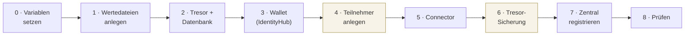

# Schnellstart: einen Teilnehmer aufsetzen

Vom leeren Namespace zum funktionierenden Teilnehmer. Alles zum Kopieren, ein Block pro Schritt,
keine Erklärungen dazwischen — die stehen in [dataspace-betrieb-und-aufbau.md](dataspace-betrieb-und-aufbau.md).

Beispiel ist **Dave**. Für einen neuen Teilnehmer nur den Variablenblock unten ändern.

**Dauer:** ca. 20 Minuten. **Voraussetzung:** die Zentrale (`windx-auth`) läuft bereits.



Die beiden hervorgehobenen Schritte sind die, an denen es üblicherweise schiefgeht: **4** legt
die Identität an (danach muss `did.json` mit `200` antworten), **6** macht sie neustartfest.


---

## 0. Variablen — das Einzige, was du anfasst

```bash
export P=dave                                    # Kurzname, klein
export NS=windx-$P
export BPN=BPNL00000000WD04                      # eindeutig im Datenraum
export IH_HOST=$P-windx.cluster.swms-cloud.com   # Wallet + DID
export EDC_HOST=$P-edc-windx.cluster.swms-cloud.com
export DID=did:web:$IH_HOST
export DID_B64=$(echo -n "$DID" | base64)

# Geheimnisse einmalig würfeln (nicht ins Repo!)
export VAULT_TOKEN=$(openssl rand -hex 16)
export MGMT_KEY=$(openssl rand -hex 16)
export SUPERUSER_KEY=$(openssl rand -base64 24 | tr -d '\n')

echo "DID=$DID"; echo "DID_B64=$DID_B64"
```

> **DNS:** `$IH_HOST` und `$EDC_HOST` müssen auf den nginx-Ingress zeigen, bevor du startest —
> sonst stellt cert-manager kein Zertifikat aus. Bei `*.cluster.swms-cloud.com` erledigt das
> der Wildcard-Eintrag.

**Voraussetzungen:** Kubernetes mit nginx-Ingress und cert-manager (ClusterIssuer
`letsencrypt-prod`), `helm`, `kubectl`, `jq`.

```bash
helm repo add tractusx-edc https://eclipse-tractusx.github.io/charts/dev
helm repo update
kubectl create ns $NS
```

---

## 1. Wertedateien anlegen

**Alice ist die Vorlage** — ihre Wertedateien enthalten keine Sonderfälle. (Daves Dateien
nur nehmen, wenn du bewusst die Wind-X-Dataplane willst, siehe unten.)

```bash
cd deploy/participants
for f in vault postgres ih-full conn-full; do
  sed -e "s/alice/$P/g" -e "s/BPNL00000000WA01/$BPN/g" $f-alice.yaml > $f-$P.yaml
done
```

Dann die Platzhalter ersetzen:

| Datei | Platzhalter | Wert |
|---|---|---|
| `vault-$P.yaml` | `VAULT_DEV_ROOT_TOKEN_ID` | `$VAULT_TOKEN` |
| `ih-full-$P.yaml` | `CHANGE-ME-VAULT-TOKEN` | `$VAULT_TOKEN` |
| `ih-full-$P.yaml` | `CHANGE-ME-SUPERUSER-KEY` | `$SUPERUSER_KEY` |
| `conn-full-$P.yaml` | `CHANGE-ME-VAULT-TOKEN` | `$VAULT_TOKEN` |
| `conn-full-$P.yaml` | `CHANGE-ME-MANAGEMENT-KEY` | `$MGMT_KEY` |

Prüfen, dass nichts übrig blieb:

```bash
grep -n 'CHANGE-ME\|alice' *-$P.yaml
```

> **Wind-X-Dataplane statt Upstream?** Dann zusätzlich in `conn-full-$P.yaml` den Block
> `dataplane.image` (Repository `ghcr.io/wind-x-eu/edc-dataplane-windx` + fester Tag),
> `imagePullSecrets: [{name: ghcr-windx}]` und
> `dataplane.env.TX_EDC_WINDX_MEDIATOR_BASE_URL` setzen — Vorlage ist `conn-full-dave.yaml`.
> Das Pull-Secret einmalig anlegen:
> `kubectl -n $NS create secret docker-registry ghcr-windx --docker-server=ghcr.io --docker-username=<gh-user> --docker-password=<PAT>`

---

## 2. Tresor + Datenbank

```bash
kubectl -n $NS apply -f vault-$P.yaml
kubectl -n $NS apply -f postgres-$P.yaml
kubectl -n $NS rollout status deploy/$P-vault
kubectl -n $NS rollout status deploy/$P-postgres
```

> `postgres-*.yaml` **muss** ein PVC verwenden, kein `emptyDir` — sonst ist die Identität beim
> nächsten Pod-Umzug weg ([Vorfall 23.08.2026](vorfall-2026-08-23-identitaetsverlust.md)).

Super-User-Schlüssel für die Verwaltungs-API in den Tresor legen:

```bash
kubectl -n $NS exec deploy/$P-vault -- sh -c \
  "VAULT_ADDR=http://127.0.0.1:8200 VAULT_TOKEN=$VAULT_TOKEN \
   vault kv put secret/sup3r\\\$3cr3t content=\"$SUPERUSER_KEY\""
```

---

## 3. Wallet (IdentityHub)

```bash
helm upgrade --install $P-ih tractusx-edc/tractusx-identityhub \
  --version 0.3.2 -n $NS -f ih-full-$P.yaml
kubectl -n $NS rollout status deploy/$P-ih
```

---

## 4. Teilnehmer in der Wallet anlegen

Erzeugt Schlüsselpaar, STS-Konto und DID-Dokument. Beides landet automatisch im Tresor.

```bash
kubectl -n $NS port-forward svc/$P-ih 8082:8082 &
sleep 3

curl -s -X POST http://localhost:8082/api/identity/v1alpha/participants \
  -H 'Content-Type: application/json' -H "X-Api-Key: $SUPERUSER_KEY" \
  -d "{
    \"active\": true,
    \"did\": \"$DID\",
    \"participantContextId\": \"$DID\",
    \"key\": {
      \"keyGeneratorParams\": {\"algorithm\":\"EdDSA\",\"curve\":\"Ed25519\"},
      \"keyId\": \"$DID#signing-key-1\",
      \"privateKeyAlias\": \"$DID#signing-key-1\"
    },
    \"serviceEndpoints\": [
      {\"type\":\"CredentialService\",\"id\":\"credentialservice-1\",
       \"serviceEndpoint\":\"https://$IH_HOST/api/credentials/v1/participants/$DID_B64\"},
      {\"type\":\"ProtocolEndpoint\",\"id\":\"dsp-url\",
       \"serviceEndpoint\":\"https://$EDC_HOST/api/v1/dsp\"}
    ]}" | jq .
```

Prüfen — muss `200` und ein Dokument liefern (cert-manager braucht ggf. eine Minute):

```bash
curl -s https://$IH_HOST/.well-known/did.json | jq .
```

> **`204` statt `200`?** Der Participant Context fehlt. Nicht am Ingress suchen —
> siehe [Vorfall 23.08.2026](vorfall-2026-08-23-identitaetsverlust.md).

> **Achtung:** Dieser Schritt gilt nur für einen **neuen** Teilnehmer. Zum *Wiederherstellen*
> eines bestehenden niemals hier entlang — er erzeugt einen neuen Schlüssel und überschreibt
> den alten. Dann `ih-provision.yaml` verwenden.

---

## 5. Connector

```bash
helm upgrade --install $P-edc tractusx-edc/tractusx-connector \
  --version 0.12.1 -n $NS --server-side=false -f conn-full-$P.yaml
kubectl -n $NS rollout status deploy/$P-edc-controlplane
kubectl -n $NS rollout status deploy/$P-edc-dataplane
```

> **`--server-side=false` ist Pflicht.** Chart 0.12.1 erzeugt doppelte `WEB_HTTP_CATALOG_*`-
> Einträge; Helm 4 nutzt standardmäßig Server-Side-Apply und bricht daran ab
> (`failed to create typed patch object`). Client-Side-Apply verträgt die Dubletten.

> **Dataplane in CrashLoop?** Normal, wenn sie vor dem Controlplane hochkommt — sie fängt sich
> von selbst. Bei der Wind-X-Dataplane (`ghcr.io/wind-x-eu/edc-dataplane-windx`) muss zusätzlich
> `TX_EDC_WINDX_MEDIATOR_BASE_URL` gesetzt sein, sonst startet sie gar nicht.

---

## 6. Sicherung des Tresors einrichten

Der Tresor läuft im Dev-Modus und hält alles nur im Arbeitsspeicher. Diese beiden Jobs machen
einen Neustart überlebbar — **direkt jetzt einrichten**, nicht später:

```bash
cd ../..   # Repo-Wurzel
sed -e "s/__NS__/$NS/" -e "s/__PARTICIPANT__/$P/" deploy/participants/vault-seeder.yaml | kubectl apply -f -
kubectl -n $NS wait --for=condition=complete job/vault-seeder --timeout=120s
kubectl -n $NS logs job/vault-seeder

sed -e "s/__NS__/$NS/" -e "s/__PARTICIPANT__/$P/" deploy/participants/vault-keeper.yaml | kubectl apply -f -
```

---

## 7. Zentral registrieren und Ausweis ausstellen

Im Admin-UI `https://auth-windx.cluster.swms-cloud.com`:

1. **Participant anlegen** — `Bpn` = `$BPN`, `Did` = `$DID`,
   `CredentialServiceUrl` = `https://$IH_HOST/api/credentials/v1/participants/$DID_B64`
2. Beim Teilnehmer **„Issue Membership Credential"** auslösen.

> Die BPN muss **überall exakt gleich** sein (Zentrale, `participant.id` des Connectors,
> Katalog-Aufruf). Sonst: `Empty optional`.

Kontrolle im Wallet-Log:

```bash
kubectl -n $NS logs deploy/$P-ih | grep -i 'HolderCredentialRequest'   # … is now in state ISSUED
```

---

## 8. Fertig? Diese drei Prüfungen müssen grün sein

```bash
# 1. DID öffentlich
curl -s -o /dev/null -w 'did.json: %{http_code}\n' https://$IH_HOST/.well-known/did.json

# 2. Controlplane fehlerfrei — beide Zahlen müssen 0 sein
kubectl -n $NS logs deploy/$P-edc-controlplane | grep -c 'error caught during processor'
kubectl -n $NS logs deploy/$P-edc-controlplane | grep -ciE 'invalid_client|HTTP client exception'

# 3. Ende-zu-Ende: Katalog eines anderen Teilnehmers über dessen BPN abrufen.
#    Das ist der eigentliche Beweis — es erzwingt BDRS-Auflösung, STS-Token und Credential-Prüfung.
kubectl -n $NS port-forward svc/$P-edc-controlplane 8081:8081 &
sleep 3
curl -s -X POST http://localhost:8081/management/v3/catalog/request \
  -H "X-Api-Key: $MGMT_KEY" -H 'Content-Type: application/json' \
  -d '{"@context":{"@vocab":"https://w3id.org/edc/v0.0.1/ns/"},
       "counterPartyAddress":"https://alice-edc-windx.cluster.swms-cloud.com/api/v1/dsp",
       "counterPartyId":"BPNL00000000WA01",
       "protocol":"dataspace-protocol-http"}' | jq .
```

---

## Wenn es klemmt

| Symptom | Ursache |
|---|---|
| `did.json` → `204` | Participant Context fehlt (Schritt 4), **kein** Ingress-Problem |
| `helm` → `failed to create typed patch object` | `--server-side=false` vergessen (Schritt 5) |
| `401 invalid_client` bei `/api/sts/token` | STS-Konto fehlt oder Tresor ist leer |
| `Empty optional` | BPN stimmt an einer der drei Stellen nicht überein |
| Dataplane startet nicht | Bei der Wind-X-Dataplane fehlt `TX_EDC_WINDX_MEDIATOR_BASE_URL` |

Ausführliche Diagnosekette: [Vorfall 23.08.2026](vorfall-2026-08-23-identitaetsverlust.md) Abschnitt 4.
Fehlertabelle für den laufenden Betrieb: [dataspace-betrieb-und-aufbau.md](dataspace-betrieb-und-aufbau.md) Abschnitt 6.

## Weiterführend

- **Was die Schritte bewirken, in einfacher Sprache:** [dataspace-betrieb-und-aufbau.md](dataspace-betrieb-und-aufbau.md)
- **Vollständige Referenz** (jeder Chart-Wert, jede Umgebungsvariable): [DEPLOY.md](DEPLOY.md)
- **Protokollabläufe mit Sequenzdiagrammen:** [gesamtsetup-alice-bob-dcp.md](gesamtsetup-alice-bob-dcp.md)
