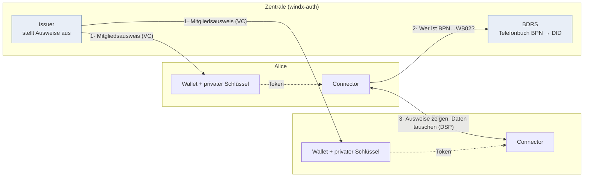

# Dataspace: Was läuft, wie es funktioniert, wie man es neu aufsetzt

Diese Doku beschreibt den kompletten Aufbau im Cluster: **was installiert ist**, **was dabei
genau passiert** und **wie man alles von Null neu aufsetzt**. Sprache bewusst einfach; alle
Abkürzungen werden bei der ersten Nennung erklärt.

> **Nur schnell einen Teilnehmer aufsetzen?** → [QUICKSTART.md](QUICKSTART.md) — dieselben
> Schritte zum Kopieren, ohne Erklärungen dazwischen.

---

## 1. Abkürzungen (einmal in Ruhe)

| Kürzel | Bedeutung | In einem Satz |
|---|---|---|
| **DID** | Decentralized Identifier | Eine Ausweisnummer, die man selbst besitzt, z. B. `did:web:alice-windx.cluster.swms-cloud.com`. Bei `did:web` liegt der zugehörige öffentliche Schlüssel einfach als Datei auf genau diesem Webserver. |
| **DID-Dokument** | – | Die Datei hinter der DID (`/.well-known/did.json`). Enthält den **öffentlichen** Schlüssel und wo man den Teilnehmer erreicht. |
| **VC** | Verifiable Credential | Ein digital unterschriebener Nachweis, z. B. „Alice ist Mitglied im Dataspace". |
| **VP** | Verifiable Presentation | Ein VC, das der Inhaber **vorzeigt** und dabei selbst mitunterschreibt („das gehört wirklich mir"). |
| **Wallet** | – | Der Ort, an dem ein Teilnehmer seine VCs aufbewahrt. Hier: der IdentityHub. |
| **IH** | IdentityHub | Die Wallet-Software eines Teilnehmers. Hält Schlüssel + VCs und stellt VPs aus. |
| **STS** | Secure Token Service | Teil des IH. Stellt kurzlebige Tokens aus, weil **nur der IH** den privaten Schlüssel hat. |
| **EDC** | Eclipse Dataspace Connector | Die Software, die Daten anbietet und abruft („Connector"). |
| **DSP** | Dataspace Protocol | Die Sprache, die zwei Connectoren miteinander sprechen (Katalog, Vertrag, Transfer). |
| **DCP** | Decentralized Claims Protocol | Die Sprache für **Credentials**: ausstellen und vorzeigen. |
| **BPN** | Business Partner Number | Die Firmennummer, z. B. `BPNL00000000WA01`. |
| **BDRS** | BPN-DID Resolution Service | Ein Telefonbuch: „zu welcher DID gehört diese BPN?" |
| **Issuer** | Aussteller | Die zentrale Stelle, die VCs ausstellt und unterschreibt. |
| **Vault** | – | Tresor für Geheimnisse (private Schlüssel, Passwörter). |

---

## 2. Das Grundprinzip in fünf Sätzen

1. Jeder Teilnehmer (Alice, Bob) hat eine **eigene DID** und eine **eigene Wallet**.
2. Eine **zentrale Stelle** stellt „Mitgliedsausweise" (**MembershipCredential**) aus und betreibt
   das Telefonbuch (**BDRS**). Mehr macht sie nicht.
3. Wollen zwei Teilnehmer Daten tauschen, **zeigen sie sich gegenseitig ihren Ausweis** — nicht die
   Zentrale entscheidet, sondern die beiden prüfen selbst.
4. Geprüft wird **kryptografisch**: die Unterschrift des Ausstellers wird gegen dessen öffentlichen
   Schlüssel geprüft, den man über die DID im Internet nachschlägt.
5. Deshalb ist das Ganze **dezentral**: die Zentrale kennt **kein einziges Geheimnis** der Teilnehmer.



Die Zentrale ist nur an **1** und **2** beteiligt. Der eigentliche Datenaustausch (**3**) läuft
direkt zwischen den Teilnehmern — sie prüfen sich gegenseitig selbst.

---

## 3. Was im Cluster läuft

Vier Namespaces (`kubectl get ns | grep windx`): die Zentrale plus **drei Teilnehmer**
(Alice, Bob, Dave). Jeder Teilnehmer ist vollständig autark — theoretisch könnte er bei einer
ganz anderen Firma in einem anderen Rechenzentrum stehen.

### 3.1 Zentral: Namespace `windx-auth`

| Was | Wozu |
|---|---|
| `dataspace-operator` (unsere .NET/XAF-Anwendung) | Issuer + BDRS + Admin-Oberfläche |

Öffentlich erreichbar unter **`https://auth-windx.cluster.swms-cloud.com`**:

| Adresse | Wozu |
|---|---|
| `/.well-known/did.json` | Unser DID-Dokument: unser **öffentlicher** Schlüssel + Hinweis, wo man Credentials anfragt |
| `/api/issuance/...` | Credentials ausstellen (DCP) |
| `/api/directory/bpn-directory` | Das Telefonbuch (BDRS). Nur mit gültigem Mitglieds-VP lesbar |
| `/status-lists/revocation` | Sperrliste (Widerruf) — siehe Einschränkung in Abschnitt 7 |

Die Zentrale speichert: Teilnehmer (Name, BPN, DID), ausgestellte Credentials, vertrauenswürdige
Aussteller und den **Audit-Trail**. Sie speichert **keine** privaten Schlüssel der Teilnehmer.

### 3.2 Pro Teilnehmer: `windx-alice`, `windx-bob`, `windx-dave`

Jeder Namespace enthält **fünf** Bausteine, die zusammengehören:

| Baustein | Beispiel Alice | Wozu |
|---|---|---|
| **Vault** | `alice-vault` | Tresor. Hier liegen Alices **privater** Schlüssel und ihr STS-Passwort |
| **Postgres** | `alice-postgres` | Datenbank für IH und Connector |
| **IdentityHub** | `alice-ih` | Alices Wallet: verwahrt VCs, stellt VPs aus, betreibt die STS |
| **Connector** | `alice-edc-controlplane` + `alice-edc-dataplane` | Bietet Daten an bzw. ruft sie ab |
| **vault-keeper** | `vault-keeper` | Spielt den Tresor-Inhalt nach einem Pod-Neustart automatisch zurück (siehe Abschnitt 7) |

Öffentlich erreichbar:

| Adresse | Wer | Wozu |
|---|---|---|
| `https://alice-windx.cluster.swms-cloud.com` | IdentityHub | DID-Dokument + Credential-Annahme/-Vorzeigen |
| `https://alice-edc-windx.cluster.swms-cloud.com` | Connector | DSP (`/api/v1/dsp`) + Datenabruf (`/api/public`) |

(Für Bob und Dave identisch mit `bob-…` bzw. `dave-…`.)

**Die drei Teilnehmer im Überblick:**

| | Alice | Bob | Dave |
|---|---|---|---|
| Namespace | `windx-alice` | `windx-bob` | `windx-dave` |
| BPN | `BPNL00000000WA01` | `BPNL00000000WB02` | `BPNL00000000WD04` |
| DID | `did:web:alice-windx…` | `did:web:bob-windx…` | `did:web:dave-windx…` |
| Rolle im Beispiel | Consumer | Provider (`bob-backend`) | dritter Teilnehmer |
| Besonderheit | – | nginx als Beispiel-Datenquelle | **eigenes Dataplane-Image** (siehe unten) |

> **Dave fährt eine andere Dataplane.** Statt des Upstream-Images läuft
> `ghcr.io/wind-x-eu/edc-dataplane-windx` — die offizielle SQL/Vault-Dataplane plus die Wind-X-
> Erweiterungen (`windx-mediator-proxy`, `windx-mms`, `windx-participant-log`,
> `non-finite-provider-push`). Der Controlplane bleibt unverändert Upstream. Zwei Dinge sind
> dabei Pflicht: das Pull-Secret `ghcr-windx` für die private Registry und die Variable
> `TX_EDC_WINDX_MEDIATOR_BASE_URL` — **ohne sie startet der Pod nicht**. Details in
> [DEPLOY.md](DEPLOY.md), Abschnitt „Besonderheit Dave".

> **Wichtig:** Vault + IH + Connector eines Teilnehmers teilen sich **einen** Vault. Das ist
> *innerhalb* eines Teilnehmers — nichts wird über Teilnehmergrenzen hinweg geteilt. Genau das
> macht den Aufbau dezentral-tauglich (siehe Abschnitt 7, Punkt „Warum ein geteilter Vault").

### 3.3 Beispiel-Datenquelle

`bob-backend` (nginx) in `windx-bob` liefert unter `/asset.json` eine kleine Datei. Das ist der
„interne REST-Dienst", den Bob über seinen Connector anbietet.

---

## 4. Was genau passiert — die drei Abläufe

### 4.1 Ablauf A: Teilnehmer bekommt seinen Mitgliedsausweis (DCP)

Ausgelöst im Admin-UI mit **„Issue Membership Credential"**.

1. **Angebot.** Die Zentrale schickt an Alices Wallet: „Ich hätte hier ein MembershipCredential
   für dich." (`CredentialOfferMessage`)
2. **Alice fragt selbst an.** Alices Wallet schlägt in unserem DID-Dokument nach, *wo* man
   Credentials anfragt, und schickt eine Anfrage dorthin (`CredentialRequestMessage`). Sie legt
   ein selbst unterschriebenes Token bei.
3. **Wir prüfen Alice.** Wir holen Alices DID-Dokument, nehmen ihren öffentlichen Schlüssel und
   prüfen die Unterschrift. Passt sie, antworten wir mit „angenommen" + Vorgangsnummer.
4. **Wir stellen aus und liefern.** Wir unterschreiben das VC mit **unserem** privaten Schlüssel und
   schicken es an Alices Wallet (`CredentialMessage`), passend zur Vorgangsnummer.
5. **Alice legt es ab.** Ihre Wallet ordnet es der Anfrage zu und speichert es.

> Entscheidend: **Alice fragt an, wir liefern.** Wir können nichts „hineindrücken" — das ist die
> vorgesehene Richtung im DCP.

### 4.2 Ablauf B: Zwei Teilnehmer lernen sich kennen (Vertrauen)

Alice will Bobs Katalog sehen und kennt nur seine **BPN**.

1. **Token holen.** Alices Connector hat den privaten Schlüssel *nicht* — den hat nur ihr IH.
   Also lässt er sich von der STS ein Token ausstellen (dafür braucht er das STS-Passwort aus
   dem gemeinsamen Vault).
2. **Telefonbuch fragen.** Alices Connector fragt bei uns (BDRS): „Welche DID hat `BPNL...WB02`?"
   Um überhaupt fragen zu dürfen, **zeigt er Alices Mitglieds-VP vor**. Wir prüfen: Unterschrift
   des Inhabers ✓, Unterschrift des Ausstellers ✓, Aussteller vertrauenswürdig ✓ → wir antworten.
3. **Anfragen.** Alices Connector schickt die Katalogfrage an Bobs Connector (DSP) und legt ein
   selbst unterschriebenes Token bei.
4. **Bob prüft Alice.** Bobs Connector holt sich Alices Mitglieds-VP, prüft es genauso — und
   antwortet erst dann mit dem Katalog.

### 4.3 Ablauf C: Datei abholen (DSP)

1. **Katalog** — Alice sieht Bobs Angebot (`bob-asset-1`).
2. **Vertrag** — Alice nimmt das Angebot an; beide Seiten prüfen die Regeln, es entsteht ein
   **Agreement**.
3. **Transfer** — Alice startet den Transfer. Bob liefert eine **EDR** zurück: eine Adresse plus
   ein kurzlebiges Zugriffstoken.
4. **Abholen** — Alice ruft die Adresse mit dem Token ab. Bobs Dataplane holt die Datei aus
   `bob-backend` und reicht sie durch.

Ergebnis (echter Lauf):

```
{"message":"Hello Alice, this is Bob's shared file via the dataspace!","secret":"windx-42",...}
```

### 4.4 Audit-Trail

Jeder Aufruf gegen die Protokoll-Endpunkte der Zentrale wird protokolliert: Zeitpunkt, Art,
Methode, Pfad, Statuscode, Dauer, Request-Body und Ergebnis. Wenn der Aufruf einem Teilnehmer
zugeordnet werden kann (über die DID), erscheint er im Admin-UI direkt **beim Teilnehmer** unter
`AuditEntries`. Das Protokollieren kann einen Protokollaufruf nie zum Scheitern bringen.

---

## 5. Frisch aufsetzen (von Null)

> Für **einen einzelnen Teilnehmer** ist [QUICKSTART.md](QUICKSTART.md) der kürzere Weg —
> dieselben Schritte, aber mit Variablen und ohne Zwischentext.

Voraussetzungen: Kubernetes mit **nginx-Ingress** und **cert-manager** (ClusterIssuer
`letsencrypt-prod`), DNS zeigt auf den Ingress, Helm installiert.

```bash
helm repo add tractusx-edc https://eclipse-tractusx.github.io/charts/dev
helm repo update
kubectl create ns windx-auth; kubectl create ns windx-alice; kubectl create ns windx-bob; kubectl create ns windx-dave
```

### Schritt 1 — Zentrale

```bash
helm upgrade --install dataspace-operator ./helm/dataspace-operator \
  -n windx-auth -f windx-values.yaml
```

Wichtige Werte in `windx-values.yaml`:

```yaml
image: { repository: ghcr.io/swmsconsulting/dataspaceoperator, tag: sha-XXXXXXX }
issuer:
  did: did:web:auth-windx.cluster.swms-cloud.com
  privateSeedBase64: "<32-Byte-Ed25519-Seed, base64>"   # unser privater Schlüssel
  includeCredentialStatus: false                        # siehe Abschnitt 7
admin: { username: "Admin", password: "<Passwort>" }
```

Prüfen: `curl https://auth-windx.cluster.swms-cloud.com/.well-known/did.json` muss das
DID-Dokument liefern (inkl. `IssuerService`-Eintrag).

### Schritt 2 — Pro Teilnehmer: Vault + Postgres

```bash
kubectl -n windx-alice apply -f vault-alice.yaml      # dev-mode, Token je Teilnehmer eigener Zufallswert
kubectl -n windx-alice apply -f postgres-alice.yaml   # DBs: ih + edc, auf PVC
```

> **Postgres muss auf einem PVC liegen, nicht auf `emptyDir`.** Sonst ist beim nächsten
> Pod-Umzug die Identität des Teilnehmers weg — genau das ist am 23.08.2026 passiert
> ([Vorfallbericht](vorfall-2026-08-23-identitaetsverlust.md)).

Super-User-Schlüssel für die Verwaltungs-API des IH in den Vault legen:

```bash
kubectl -n windx-alice exec deploy/alice-vault -- sh -c \
  "VAULT_ADDR=http://127.0.0.1:8200 VAULT_TOKEN=$VAULT_TOKEN \
   vault kv put secret/sup3r\\\$3cr3t content=\"$SUPERUSER_KEY\""
```

> Der Wert ist frei wählbar (`openssl rand -base64 24`) und derselbe, den du später als
> `X-Api-Key` sendest. Der frühere MXD-Standardwert ist rotiert und nicht mehr gültig.

### Schritt 3 — IdentityHub (Wallet)

```bash
helm upgrade --install alice-ih tractusx-edc/tractusx-identityhub \
  --version 0.3.2 -n windx-alice -f ih-full-alice.yaml
```

### Schritt 4 — Teilnehmer im IdentityHub anlegen

Erzeugt Alices Schlüsselpaar, ihr STS-Konto und ihr DID-Dokument. **Die Antwort enthält das
`clientSecret` — es landet automatisch im gemeinsamen Vault**, der Connector liest es von dort.

```bash
kubectl -n windx-alice port-forward svc/alice-ih 8082:8082 &
curl -X POST http://localhost:8082/api/identity/v1alpha/participants \
 -H 'Content-Type: application/json' \
 -H "X-Api-Key: $SUPERUSER_KEY" \
 -d '{
  "active": true,
  "did": "did:web:alice-windx.cluster.swms-cloud.com",
  "participantContextId": "did:web:alice-windx.cluster.swms-cloud.com",
  "key": { "keyGeneratorParams": {"algorithm":"EdDSA","curve":"Ed25519"},
           "keyId": "did:web:alice-windx.cluster.swms-cloud.com#signing-key-1",
           "privateKeyAlias": "did:web:alice-windx.cluster.swms-cloud.com#signing-key-1" },
  "serviceEndpoints": [
    {"type":"CredentialService","id":"credentialservice-1",
     "serviceEndpoint":"https://alice-windx.cluster.swms-cloud.com/api/credentials/v1/participants/<BASE64-DER-DID>"},
    {"type":"ProtocolEndpoint","id":"dsp-url",
     "serviceEndpoint":"https://alice-edc-windx.cluster.swms-cloud.com/api/v1/dsp"}
  ]}'
```

`<BASE64-DER-DID>`: `echo -n "did:web:alice-windx.cluster.swms-cloud.com" | base64`

### Schritt 5 — Connector

```bash
helm upgrade --install alice-edc tractusx-edc/tractusx-connector \
  --version 0.12.1 -n windx-alice --server-side=false -f conn-full-alice.yaml
```

> **Achtung, Chart-Fehler:** `tractusx-connector` 0.12.1 erzeugt doppelte `WEB_HTTP_CATALOG_*`-
> Einträge. Helm 4 nutzt standardmäßig Server-Side-Apply und bricht daran ab
> (`failed to create typed patch object`). Abhilfe ist schlicht **`--server-side=false`** —
> Client-Side-Apply verträgt die Dubletten. Das Chart muss dafür *nicht* lokal gepatcht werden.

> **Reihenfolge:** Die Dataplane meldet sich beim Controlplane an. Startet sie zuerst, geht sie
> in CrashLoop — nach dem Hochlaufen des Controlplane fängt sie sich von selbst.

### Schritt 6 — Tresor-Sicherung einrichten

Der Tresor läuft im Dev-Modus und hält alles nur im Arbeitsspeicher. Diese beiden Jobs machen
einen Pod-Neustart überlebbar — **jetzt einrichten, nicht später**:

```bash
sed -e 's/__NS__/windx-alice/' -e 's/__PARTICIPANT__/alice/' \
  deploy/participants/vault-seeder.yaml | kubectl apply -f -
kubectl -n windx-alice wait --for=condition=complete job/vault-seeder --timeout=120s

sed -e 's/__NS__/windx-alice/' -e 's/__PARTICIPANT__/alice/' \
  deploy/participants/vault-keeper.yaml | kubectl apply -f -
```

`vault-seeder` schreibt den aktuellen Tresor-Inhalt in das Secret `vault-backup`,
`vault-keeper` spielt ihn nach einem Neustart automatisch zurück. Beide laufen vollständig im
Cluster — privates Schlüsselmaterial landet nie auf einem Arbeitsplatz. Der Seeder bricht ab,
wenn der Tresor leer ist, damit er kein gutes Backup mit einem leeren überschreibt.

### Schritt 7 — Teilnehmer zentral registrieren

Im Admin-UI (`https://auth-windx.cluster.swms-cloud.com`) je einen Participant anlegen:

| Feld | Alice | Bob | Dave |
|---|---|---|---|
| Bpn | `BPNL00000000WA01` | `BPNL00000000WB02` | `BPNL00000000WD04` |
| Did | `did:web:alice-windx.cluster.swms-cloud.com` | `did:web:bob-windx.cluster.swms-cloud.com` | `did:web:dave-windx.cluster.swms-cloud.com` |
| CredentialServiceUrl | `https://alice-windx…/api/credentials/v1/participants/<BASE64>` | analog | analog |

> Die **BPN muss überall exakt gleich** sein: hier, in `participant.id` des Connectors und im
> Katalog-Aufruf. Ein Tippfehler führt zu „Empty optional" bei der Auflösung.

### Schritt 8 — Credentials ausstellen

Im Admin-UI beim Teilnehmer **„Issue Membership Credential"**. Kontrolle im IH-Log:
`HolderCredentialRequest … is now in state ISSUED`.

### Schritt 9 — Anbieter einrichten und testen

Auf Bobs Connector (Management-API, Key aus `controlplane.endpoints.management.authKey`) Asset, Policy und
Contract-Definition anlegen; dann von Alice aus: Katalog → Negotiation → Transfer → Abruf.
Die konkreten Aufrufe stehen in `DEPLOY.md`.

---

## 6. Wo man nachschaut, wenn etwas klemmt

| Symptom | Wo nachsehen |
|---|---|
| Credential kommt nicht an | IH-Log des Empfängers: `state ISSUED` oder `state ERROR` mit Grund |
| `401` beim BDRS | Zentrale-Log: `BDRS read rejected: …` nennt den genauen Grund |
| `did.json` liefert `204` | Kein Ingress-Problem — der IdentityHub hat keinen Participant Context mehr. Siehe [Vorfall 23.08.2026](vorfall-2026-08-23-identitaetsverlust.md) |
| `HTTP client exception … /api/sts/token` | Ist ein `401 invalid_client`: STS-Account fehlt. Gleiche Ursache wie oben |
| Controlplane-Log voll mit `error caught during processor` | Reine Folgewirkung — nie die Ursache. Prüfkette in [Vorfall 23.08.2026](vorfall-2026-08-23-identitaetsverlust.md) Abschnitt 4 abarbeiten |
| `Empty optional` | BPN stimmt nicht überein (Zentrale ⇄ Connector ⇄ Aufruf) |
| Connector-Fehler ohne Details | Log4j2-Template des Connectors zeigt standardmäßig **keine** Stacktraces — im ConfigMap `…-log4j2` einen `exception`-Resolver ergänzen |
| Katalog `500` bei der Gegenseite | Meist die Credential-Prüfung; Stacktrace im Controlplane-Log der Gegenseite |

Audit-Trail im Admin-UI: jeder Aufruf mit Zeit, Pfad, Status und Ergebnis — beim jeweiligen
Teilnehmer.

---

## 7. Bekannte Einschränkungen und bewusste Entscheidungen

**Widerruf (Revocation) ist derzeit ausgeschaltet.** Grund: Der IdentityHub lädt die Sperrliste und
erwartet ein **signiertes JWT**; der EDC-Connector lädt **dieselbe URL** und erwartet **JSON**.
Beide fragen identisch an (gleicher HTTP-Client, `Accept: */*`) — eine Unterscheidung ist nicht
möglich. Damit Vorzeigen *und* Prüfen funktionieren, wird `credentialStatus` derzeit weggelassen:

```yaml
issuer:
  includeCredentialStatus: false
```

Auf `true` stellen, sobald beide Seiten dasselbe Format akzeptieren. Ohne `credentialStatus`
prüft keine Seite die Sperrliste — ausgestellte Credentials gelten bis zum Ablaufdatum.

**Warum ein geteilter Vault kein Widerspruch zur Dezentralität ist.** Der Vault wird nur
*innerhalb eines Teilnehmers* geteilt (Alices IH + Alices Connector). Er enthält Alices eigene
Geheimnisse in Alices eigener Infrastruktur. Die Zentrale hat darauf keinen Zugriff und speichert
selbst kein einziges Teilnehmer-Geheimnis. Genau so ist der tractusx-Standardaufbau gedacht.

**Härtung — Stand:**

| Punkt | Status |
|---|---|
| `POST /api/issuance/offer` | **Abgesichert.** Erfordert `X-Api-Key` (Wert aus `operator.apiKey`, liegt im Kubernetes-Secret). Ohne konfigurierten Key wird die Route **gar nicht erst gemappt** (fail closed). Die UI-Aktion ist unabhängig davon — sie ruft den Dienst prozessintern auf. |
| Vault-Token | **Rotiert.** Kein `root` mehr; je Teilnehmer ein eigener Zufallswert. |
| Connector-Management-Key | **Rotiert.** Kein `password` mehr; je Teilnehmer eigener Zufallswert. |
| IH-Super-User-Key | **Rotiert.** Nicht mehr der MXD-Standardwert. |
| Angriffsfläche aus dem Internet | Nur: zentraler Dienst, IH (`credentials`, `did`), Connector (`protocol`, `public`). Management-API, Identity-API und Vault haben **keinen** Ingress. |

Die Dateien unter `deploy/participants/` enthalten bewusst **Platzhalter** (`CHANGE-ME-…`) — echte
Werte gehören nicht ins Repository.

**Der Tresor läuft weiterhin im Dev-Modus** und hält seine Daten nur im Arbeitsspeicher. Das ist
inzwischen aber **abgesichert**: `vault-seeder` legt ein Backup im Cluster ab, `vault-keeper`
spielt es nach einem Pod-Neustart automatisch zurück (läuft in allen drei Namespaces). Ein
Neustart kostet damit keine Identität mehr.

Dauerhaft richtig wäre trotzdem ein Vault mit File- oder Raft-Backend auf einem PVC und
regulärem Unseal — der Keeper ist ein Pflaster, keine Lösung.

**Weiterhin offen (bewusst):**
- **Stiller Ausfall.** Bereitschaftsprüfungen melden `Ready`, auch wenn die Identität fehlt.
  Ein Health-Check, der `did.json` und einen STS-Token-Abruf prüft, fehlt noch.
- **Widerruf** ist ausgeschaltet (siehe oben).
- **Vault im Dev-Modus** (siehe Absatz darüber).

**Versionen:** IdentityHub-Chart `0.3.2`, Connector-Chart `0.12.1` (unverändert, mit `--server-side=false` installiert) — zwei
verschiedene Release-Stränge. Beim Aktualisieren beide zusammen prüfen.
