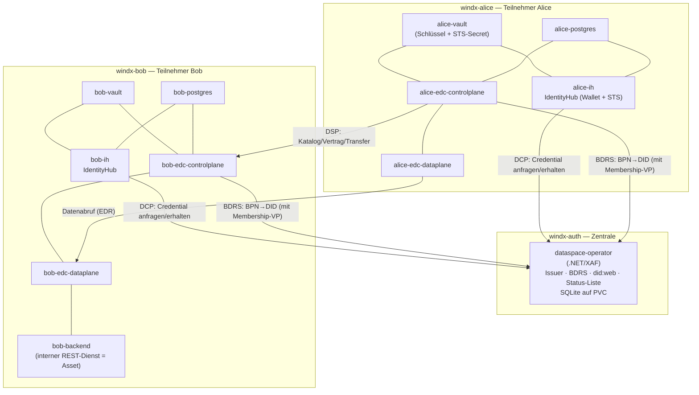
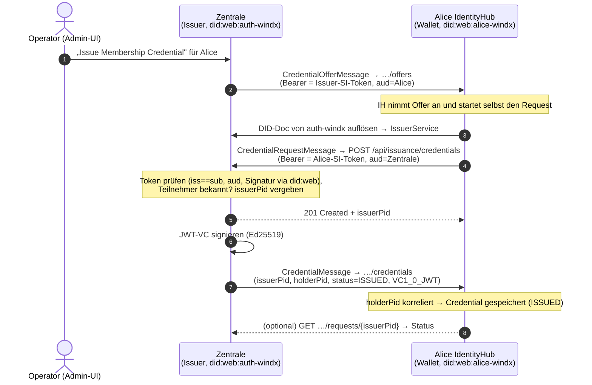
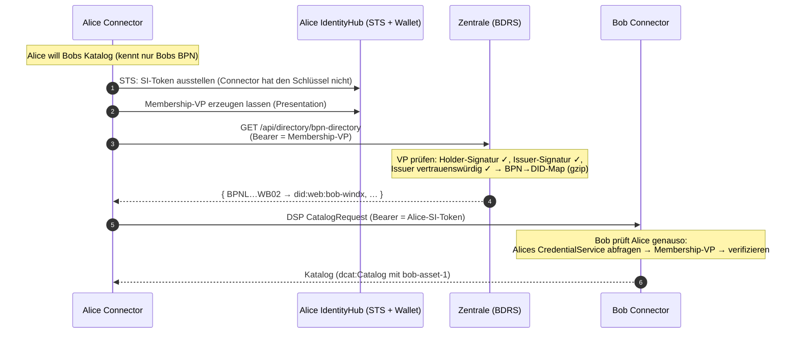
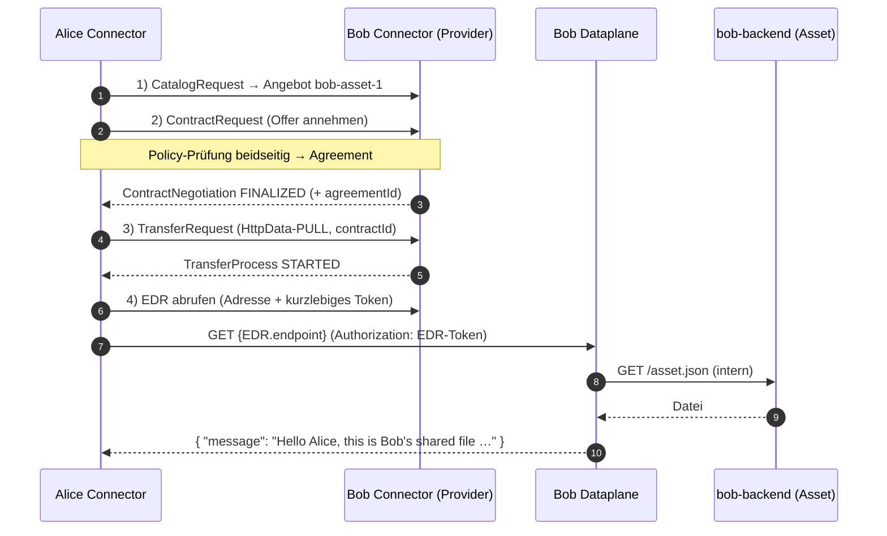
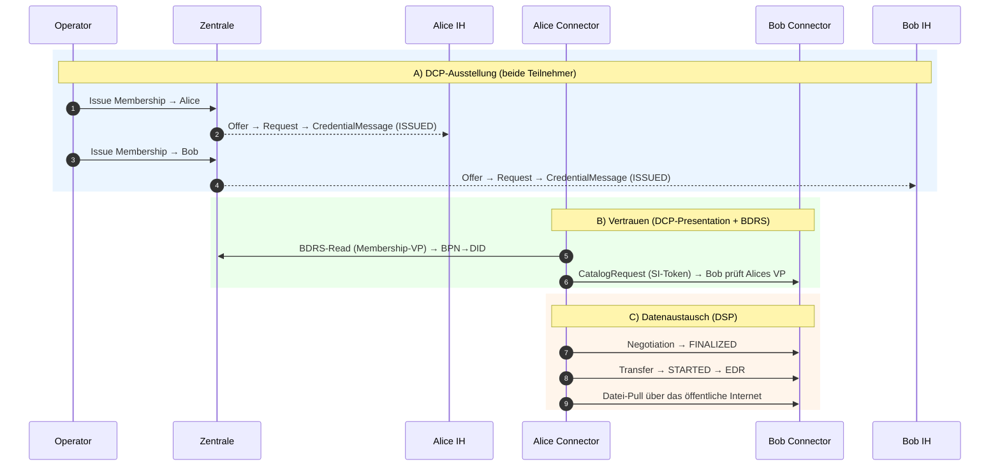

# Gesamtdokumentation: Dataspace-Setup mit Alice & Bob (inkl. DCP-Protokoll)

Diese Doku beschreibt das **komplette Setup end-to-end**: die zentrale Stelle, die beiden
Teilnehmer Alice und Bob, wie Credentials nach dem **DCP-Protokoll** ausgestellt werden und wie
Alice am Ende eine Datei von Bob abholt — nur über das öffentliche Internet.

> Ergänzende Dokumente: [Betrieb & Neuaufbau (einfache Sprache)](dataspace-betrieb-und-aufbau.md) ·
> [.NET-Architektur](architektur-dotnet.md) · [Deploy-Sequenz](DEPLOY.md).

---

## 1. Abkürzungen

| Kürzel | Bedeutung |
|---|---|
| **DID** | Decentralized Identifier (`did:web:…` → Schlüssel liegt als Datei auf genau diesem Host) |
| **VC / VP** | Verifiable Credential (unterschriebener Nachweis) / Verifiable Presentation (vorgezeigtes VC, vom Inhaber mitunterschrieben) |
| **IH** | IdentityHub — die Wallet eines Teilnehmers (verwahrt VCs, stellt VPs aus, betreibt die STS) |
| **STS** | Secure Token Service (Teil des IH; stellt kurzlebige Self-Issued-Tokens aus) |
| **EDC** | Eclipse Dataspace Connector (bietet Daten an / ruft ab) |
| **DSP** | Dataspace Protocol (Connector ↔ Connector: Katalog, Vertrag, Transfer) |
| **DCP** | Decentralized Claims Protocol (Credentials: **ausstellen** und **vorzeigen**) |
| **BPN** | Business Partner Number (Firmennummer) |
| **BDRS** | BPN-DID Resolution Service (Telefonbuch BPN → DID) |
| **EDR** | Endpoint Data Reference (Adresse + kurzlebiges Token zum Datenabruf) |
| **SI-Token** | Self-Issued Token (JWT, `iss==sub==` eigene DID, vom DID-Schlüssel signiert) |

---

## 2. Wer ist wer (konkret)

| | Zentrale (Issuer + BDRS) | Alice | Bob |
|---|---|---|---|
| Namespace | `windx-auth` | `windx-alice` | `windx-bob` |
| DID | `did:web:auth-windx.cluster.swms-cloud.com` | `did:web:alice-windx.cluster.swms-cloud.com` | `did:web:bob-windx.cluster.swms-cloud.com` |
| BPN | – | `BPNL00000000WA01` | `BPNL00000000WB02` |
| Wallet/IH öffentlich | – | `https://alice-windx.cluster.swms-cloud.com` | `https://bob-windx.cluster.swms-cloud.com` |
| Connector (DSP) öffentlich | – | `https://alice-edc-windx.cluster.swms-cloud.com/api/v1/dsp` | `https://bob-edc-windx.cluster.swms-cloud.com/api/v1/dsp` |
| Rolle im Beispiel | stellt Ausweise aus, betreibt BDRS | **Consumer** (holt die Datei) | **Provider** (bietet die Datei) |

**Dezentralitäts-Prinzip:** Alice und Bob haben je einen **vollständig eigenen** Stack. Die
Zentrale hält **kein einziges Teilnehmer-Geheimnis** — sie stellt nur VCs aus und beantwortet
BDRS-Anfragen. Alice und Bob reden ausschließlich über öffentliche HTTPS-Endpunkte miteinander.

---

## 3. Topologie



Der Vault eines Teilnehmers wird nur **innerhalb** dieses Teilnehmers geteilt (sein IH und sein
Connector) — nie über Teilnehmergrenzen hinweg. Genau das macht den Aufbau dezentral-tauglich.

---

## 4. Das DCP-Protokoll (Credentials ausstellen)

**DCP = Decentralized Claims Protocol** (Eclipse-Dataspace-Arbeitsgruppe). Es regelt zwei Dinge:
Credentials **ausstellen** (Issuance) und **vorzeigen** (Presentation). Alles ist
**public-key-basiert** — es gibt keine über Teilnehmer geteilten Geheimnisse.

### 4.1 Die Nachrichten der Issuance

| Nachricht | Richtung | Bei uns über |
|---|---|---|
| `CredentialOfferMessage` | Issuer → Wallet (`…/offers`) | `HttpCredentialOfferService` |
| `CredentialRequestMessage` | Wallet → Issuer (`{IssuerService}/credentials`) | `POST /api/issuance/credentials` |
| `CredentialMessage` | Issuer → Wallet-Storage (`…/credentials`) | `HttpCredentialDeliveryService` |
| `CredentialStatus` (Request-Status) | Wallet → Issuer (`…/requests/{issuerPid}`) | `GET /api/issuance/requests/{issuerPid}` |

Wichtige Felder: `issuerPid`/`holderPid` (korrelieren Anfrage und Zustellung), `status: "ISSUED"`,
`format: "VC1_0_JWT"` bzw. das Profil `vc11-sl2021/jwt`. Authentifiziert wird jede Nachricht mit
einem **SI-Token** (`iss==sub==` Absender-DID, `aud==` Empfänger-DID, signiert vom DID-Schlüssel).

### 4.2 Discovery

Die Wallet findet den Issuer über dessen **DID-Dokument**: dort steht ein Service-Eintrag vom Typ
`IssuerService`. An dessen Endpunkt hängt die Wallet `/credentials` an. Unsere Zentrale
veröffentlicht diesen Eintrag in `/.well-known/did.json` (Origin aus der DID abgeleitet, nicht aus
dem Request — wegen Reverse-Proxy).

### 4.3 Ablauf: Alice bekommt ihr MembershipCredential

Ausgelöst im Admin-UI mit **„Issue Membership Credential"** (oder über den geschützten
`POST /api/issuance/offer`).



**Entscheidend:** Die Wallet **fragt an**, die Zentrale **liefert** — das ist die vorgesehene
Richtung im DCP. Für Bob läuft es identisch mit seinen Werten.

### 4.4 Was DCP-typisch geprüft wird

- **Signatur des Anfrage-Tokens** gegen Alices did:web-Schlüssel (unser `SelfIssuedToken.VerifyAsync`
  akzeptiert `EdDSA`, den nicht-standardisierten Alg-Namen `Ed25519` und `ES256`/P-256).
- **`iss==sub`**, **`aud==`** unsere DID, `nbf`/`exp` gültig.
- Der Holder muss ein **bekannter Teilnehmer** sein.
- Bei der Zustellung prüft die Wallet **unser** Token gegen unseren did:web-Schlüssel und
  korreliert per `holderPid`.

---

## 5. Vertrauen zwischen Alice und Bob (DCP-Presentation + BDRS)

Bevor Daten fließen, prüfen sich Alice und Bob **gegenseitig** — nicht die Zentrale entscheidet.



Die Zentrale ist hier reiner **Vertrauensanker**: sie stellt die Mitgliedschaft aus und löst
BPN→DID auf. Sie sieht die eigentlichen Daten nie.

---

## 6. Datenaustausch (DSP): Alice holt Bobs Datei

Sobald das Vertrauen steht, läuft der reine **DSP**-Teil zwischen den Connectoren.



Ergebnis (echter Lauf):

```json
{"message":"Hello Alice, this is Bob's shared file via the dataspace!","secret":"windx-42"}
```

---

## 7. End-to-End in Kurzform (die ganze Kette)



---

## 8. Komponenten-Referenz

### 8.1 Zentrale (`windx-auth`)

`dataspace-operator` — eigene .NET/XAF-Anwendung. Öffentlich:

| Endpunkt | Zweck | DCP/Standard-Bezug |
|---|---|---|
| `GET /.well-known/did.json` | Issuer-DID-Doc inkl. `IssuerService` | W3C did:web + DCP-Discovery |
| `GET /api/issuance/.well-known/vci` | Issuer-Metadata (`credentialsSupported`) | DCP-Issuance |
| `POST /api/issuance/credentials` | nimmt `CredentialRequestMessage` an | DCP-Issuance |
| `GET /api/issuance/requests/{issuerPid}` | Request-Status (`CredentialStatus`) | DCP-Issuance |
| `POST /api/issuance/offer` | Operator-Trigger (sendet `CredentialOfferMessage`), **API-Key-geschützt** | DCP-Issuance |
| `GET /api/directory/bpn-directory` | BPN→DID (nur mit Membership-VP) | BDRS |
| `GET /status-lists/revocation` | Widerrufs-Credential (JSON-LD/JWT) | W3C BitstringStatusList |

Persistenz: SQLite auf PVC. Issuer-Schlüssel: Kubernetes-Secret. **Kein Vault, keine
Teilnehmer-Secrets.**

### 8.2 Pro Teilnehmer (`windx-alice` / `windx-bob`)

| Komponente | Aufgabe | Öffentlich? |
|---|---|---|
| **Vault** (`*-vault`) | privater DID-Schlüssel + STS-Secret des Teilnehmers | nein |
| **Postgres** (`*-postgres`) | Persistenz für IH und Connector | nein |
| **IdentityHub** (`*-ih`) | Wallet: VCs verwahren, VPs ausstellen, STS | ja: `credentials`, `did` |
| **Connector** (`*-edc-controlplane` + `*-edc-dataplane`) | DSP + Datenabruf | ja: `protocol` (`/api/v1/dsp`), `public` (`/api/public`) |
| **bob-backend** (nur Bob) | interner REST-Dienst = angebotenes Asset | nein (nur über den Connector) |

---

## 9. Warum der Connector eine STS braucht (die „Secret"-Frage)

Der Connector besitzt den **privaten DID-Schlüssel nicht** — den hat nur der IdentityHub. Also
lässt sich der Connector vom **STS** seines eigenen IH Tokens ausstellen. Dafür authentifiziert er
sich per OAuth-Client-Secret. Dieses Secret ist **teilnehmer-intern** (Alices Connector ↔ Alices
IH), liegt in Alices **gemeinsamem Vault** und verlässt Alices Infrastruktur nie. Es ist **kein**
Bestandteil des DCP-Protokolls (DCP zwischen Teilnehmern ist rein public-key-basiert), sondern ein
EDC-Implementierungsdetail der Aufteilung Connector ↔ Wallet.

---

## 10. Bekannte Einschränkungen (bewusst)

- **Widerruf ausgeschaltet** (`Issuer:IncludeCredentialStatus=false`): Der IdentityHub validiert die
  Status-Liste als **JWT**, der EDC-Connector lädt dieselbe URL und erwartet **JSON** — die Requests
  sind ununterscheidbar. Damit Vorzeigen *und* Prüfen funktionieren, wird `credentialStatus`
  weggelassen; ohne es prüft keine Seite die Sperrliste (VCs gelten bis Ablauf).
- **Teilnehmer-Vault im Dev-Modus** (nur RAM): Nach einem Vault-Neustart müssen Teilnehmer neu
  provisioniert und Credentials neu ausgestellt werden (IH-DB vorher zurücksetzen). Der **zentrale**
  Dienst ist nicht betroffen (SQLite auf PVC + Issuer-Schlüssel im K8s-Secret).
- **Connector-Chart-Fix:** `tractusx-connector` 0.12.1 erzeugt doppelte Catalog-Env-Keys; lokal
  gepatcht (siehe Betriebsdoku).
- **Härtung:** `POST /api/issuance/offer` ist per Operator-API-Key geschützt; alle
  Default-Credentials (Vault-Token, Management-Key, IH-Super-User-Key) sind rotiert.

---

## 11. Schnellprüfung des Live-Stands

```bash
# DID-Dokumente erreichbar (200)?
curl -s -o /dev/null -w "%{http_code}\n" https://auth-windx.cluster.swms-cloud.com/.well-known/did.json
curl -s -o /dev/null -w "%{http_code}\n" https://alice-windx.cluster.swms-cloud.com/.well-known/did.json
curl -s -o /dev/null -w "%{http_code}\n" https://bob-windx.cluster.swms-cloud.com/.well-known/did.json

# Alle Pods laufen?
kubectl -n windx-auth  get pods
kubectl -n windx-alice get pods
kubectl -n windx-bob   get pods
```

Der vollständige Ablauf (Katalog → Negotiation → Transfer → Pull) mit konkreten Aufrufen steht in
[`DEPLOY.md`](DEPLOY.md), die schrittweise Erstinstallation in
[`dataspace-betrieb-und-aufbau.md`](dataspace-betrieb-und-aufbau.md).
