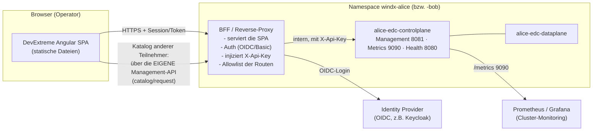

# Umsetzungsplan: EDC-Management-WebUI (DevExtreme Angular)

Ziel: eine **Web-Oberfläche pro Teilnehmer** (Alice, Bob …), mit der der EDC-Connector produktiv
bedient und überwacht werden kann — Katalog ansehen/durchsuchen (eigener und der von Partnern, zu
denen wir Rechte haben), Assets/Policies/Verträge verwalten, heute deploy-fest gesetzte Einstellungen
zur Laufzeit pflegen und ein **Monitoring** des Connectors bereitstellen.

> Status: **Planungsdokument** (noch keine Implementierung). Grundlage sind die real laufenden
> Connectoren (tractusx-connector 0.12.1) in `windx-alice`/`windx-bob`.
>
> Hinweis zu **dxdocs**: Die DevExpress-Doku-Anbindung war beim Erstellen dieses Plans nicht
> verbunden. Punkte, die ich damit final verifizieren würde, sind unten mit **⟨dxdocs⟩** markiert.

---

## 1. Randbedingungen (aus dem Ist-Stand verifiziert)

- Die EDC-**Management-API** liegt auf Port **8081** (`/management/v3/…`), ist per **`X-Api-Key`**
  geschützt und **nicht** über einen Ingress erreichbar — nur cluster-intern.
- Erreichbare v3-Ressourcen: `assets`, `policydefinitions`, `contractdefinitions`, `catalog/request`,
  `contractnegotiations`, `transferprocesses`, `contractagreements`, `edrs`.
- Weitere Ports: `control` 8083, `protocol/DSP` 8084, `catalog-cache` 8085, **`metrics` 9090**,
  Dataplane `public` 8081 / `proxy` 8186; **Health/Liveness/Readiness** auf Port **8080**
  (`/api/check/health|liveness|readiness`).
- Jeder Teilnehmer hat **einen eigenen** Connector in seinem eigenen Namespace (dezentral).

**Wichtigste Konsequenz für die Architektur:** Der Management-API-Key darf **niemals in den Browser**
gelangen, und die Management-API ist ohnehin nicht öffentlich. Eine reine SPA im Browser kann sie
also nicht direkt aufrufen. Es braucht einen **serverseitigen Vermittler (BFF/Proxy)**, der
(a) im Teilnehmer-Namespace läuft und die interne Management-API erreicht, (b) den `X-Api-Key`
serverseitig injiziert und (c) selbst durch echte Benutzer-Authentifizierung geschützt ist.

---

## 2. Zielarchitektur



**Kernidee zum Partner-Katalog:** Fremdkataloge werden **nicht** direkt beim Partner abgefragt,
sondern über die **eigene** Management-API (`POST /v3/catalog/request` mit DSP-Adresse + BPN des
Partners). Der eigene Connector übernimmt Trust (Membership-VP), BDRS-Auflösung und DSP. Die UI
braucht also nur den **eigenen** Connector — „Rechte zu Partnern" ergeben sich aus den vorhandenen
Credentials, nicht aus zusätzlichem Zugriff.

### 2.1 BFF/Proxy — zwei Varianten

| Variante | Beschreibung | Aufwand | Empfehlung |
|---|---|---|---|
| **A) nginx + oauth2-proxy** | nginx serviert die SPA und reverse-proxyt `/api/edc/*` → `controlplane:8081/management/v3/*` mit statischem `proxy_set_header X-Api-Key`. `oauth2-proxy` davor für OIDC-Login. Reine Config, **kein Custom-Code**. | gering | **Start hier** (schnell, sicher genug) |
| **B) schlanker BFF-Dienst** (.NET/Node) | Eigener Dienst: OIDC, **rollenbasierte** Freigaben (read-only vs. write), Request-Allowlist/Validierung, Aggregation mehrerer Endpunkte, Audit der UI-Aktionen, optional mehrere Connectoren. | mittel | später, wenn RBAC/Audit/Multi-Connector gebraucht wird |

Für den ersten produktiven Schritt reicht **Variante A**. Die SPA spricht dann nur mit
`/api/edc/*` (gleicher Origin), der Proxy injiziert Key + Auth.

---

## 3. Was ist zur Laufzeit managebar — was bleibt deploy-fest?

| Bereich | Laufzeit (über Management-API → UI) | Deploy-fest (nur lesend anzeigen) |
|---|---|---|
| **Assets** | anlegen/ändern/löschen (`/v3/assets`) | — |
| **Policies** | anlegen/ändern/löschen (`/v3/policydefinitions`) | — |
| **Contract Definitions** | anlegen/ändern/löschen (`/v3/contractdefinitions`) | — |
| **Katalog** | eigener + Partner abrufen/durchsuchen (`/v3/catalog/request`) | — |
| **Negotiations / Transfers / Agreements / EDRs** | starten, verfolgen, terminieren | — |
| **Data Plane** | Registrierung/Status (`/v3/dataplanes` ⟨dxdocs/EDC⟩) | Instanz-Config |
| **Identität & Trust** | — | DID, STS, BDRS-URL, Trusted Issuers, Vault (Helm) |
| **Netzwerk/Endpunkte** | — | DSP-/Public-Hosts, Ports (Helm) |

Heute „ziemlich fest über das Deployment" gesetzt sind v. a. **Assets/Policies/Contract Definitions**
(wir legen sie per `curl` an). Genau diese werden in der UI **first-class** verwaltbar — das ist der
größte Produktivitätsgewinn.

---

## 4. Feature-Umfang der UI

### 4.1 Katalog-Browser (Kern)
- Auswahl der **Gegenstelle**: Dropdown „eigener Connector" oder ein Partner (Name/BPN/DSP-Adresse
  aus einer gepflegten Partnerliste bzw. später aus BDRS).
- **DataGrid** mit den Angeboten (`dcat:dataset`): Asset-ID, Titel, Policy-Kurzform, Verteilungen.
- **Suche/Filter/Sortierung** clientseitig (DevExtreme DataGrid-Header-Filter, Suchpanel);
  serverseitig via QuerySpec, wo die Datenmenge groß wird.
- Detail-Panel je Angebot inkl. **ODRL-Policy** (lesbar aufbereitet).
- Aktion **„Vertrag aushandeln"** direkt aus dem Katalog (füllt den Negotiation-Dialog vor).

### 4.2 Verträge & Transfers
- **Contract Negotiations**: Liste + Status (REQUESTED…FINALIZED), Detail, Start, Terminieren.
- **Transfer Processes**: Liste + Status (STARTED…COMPLETED/TERMINATED), Start (HttpData-PULL/PUSH),
  **EDR** anzeigen (Endpoint + kurzlebiges Token) und optional Datenabruf-Vorschau.
- **Contract Agreements**: Übersicht abgeschlossener Verträge.

### 4.3 Anbieter-Verwaltung (Provider)
- **Assets**: DataGrid mit Editier-Formular (DevExtreme Form), `HttpData`-Adressen inkl. Validierung.
- **Policies**: Editor für ODRL-Sets; für den Einstieg **Vorlagen** (z. B. „nur Mitglieder",
  „MembershipCredential erforderlich") statt Freitext-JSON.
- **Contract Definitions**: Zuordnung Asset-Selector ↔ Access-/Contract-Policy.

### 4.4 Einstellungen
- **Read-only-Ansicht** der deploy-festen Werte (DID, BPN, BDRS-URL, DSP-Host, Data-Plane).
- **Laufzeit-Settings**, die die Management-API erlaubt (z. B. Data-Plane-Registrierung ⟨dxdocs/EDC⟩).
- Klare Kennzeichnung „per Helm gesetzt" vs. „hier änderbar".

### 4.5 Monitoring (siehe Abschnitt 6)
- Connector-Health (Control-/Data-Plane), Zähler aktiver Negotiations/Transfers, Fehlerquote,
  letzte Aktivitäten; optional eingebettete Grafana-Panels.

---

## 5. Tech-Stack & Scaffolding (DevExtreme Angular)

**Stack:** Angular (aktuelles LTS) + **DevExtreme Angular** (`devextreme`, `devextreme-angular`).

**Voraussetzungen** (dxdocs, DevExtreme CLI): **Node.js ≥ 20.19**, **npm ≥ 9.6**.

**Scaffolding — zwei Wege** (per dxdocs bestätigt):

```bash
npm i -g devextreme-cli            # oder jeden Befehl mit npx ohne globale Installation

# A) Komplette DevExtreme-Angular-App inkl. Layout/Navigation/Themes (empfohlen für den Start)
npx devextreme-cli new angular-app edc-admin --layout side-nav-outer-toolbar
cd edc-admin && npm run start

# B) In eine bestehende Angular-CLI-App integrieren
ng new edc-admin --routing --style=scss
cd edc-admin
npx devextreme-cli add devextreme-angular    # richtet DevExtreme + Theme + Styles ein
```

**Lizenzierung (wichtig — gleiche Lehre wie beim XAF-Teil):** DevExtreme benötigt einen
**Lizenzschlüssel**, sonst erscheint ein Trial-Hinweis. Ablauf (dxdocs
`.../26_1/Guide/Common/Licensing/`): Schlüssel im **DevExpress Download Manager** holen, mit dem
**`devextreme-license`-CLI-Tool** generieren und im Code registrieren
(`import config from 'devextreme/core/config'; config({ licenseKey })`, üblich in einer generierten
`devextreme-license.ts`). Der Schlüssel wird zur **Build-Zeit** eingebettet → dieselbe
Secret-Disziplin wie beim zentralen Dienst: Schlüssel als CI-Secret/Env-Secret, **nicht** ins Repo,
und im Build-Log auf „licensed" statt „trial" prüfen.

**Views ↔ DevExtreme-Komponenten:**

| View | DevExtreme-Komponente |
|---|---|
| Katalog, Assets, Negotiations, Transfers, Agreements | **DataGrid** (Suche, Header-Filter, Sort, Master-Detail, Export) |
| Asset-/Policy-/Contract-Editor | **Form** + **Popup** |
| Navigation/Layout | **Drawer** + **Toolbar** (aus dem `side-nav`-Template) |
| Monitoring | **Chart / CircularGauge / SparkLine**, KPI-Kacheln |
| Policy-Vorlagen | **SelectBox** + **TagBox** |

**Projektstruktur (Vorschlag):**

```
src/app/
  core/            HTTP-Interceptor (Basis-URL /api/edc), Fehler-/Auth-Handling
  shared/          Modelle (Asset, Policy, Catalog, Negotiation, Transfer), DTOs, JSON-LD-Helfer
  features/
    catalog/       Katalog-Browser + Partner-Auswahl
    contracts/     Negotiations, Agreements
    transfers/     Transfers, EDR-Anzeige
    provider/      Assets, Policies, Contract-Definitions
    settings/      Read-only Deploy-Werte + Laufzeit-Settings
    monitoring/    Health + KPIs (+ Grafana-Embed)
  services/        EdcManagementService (typisierte Wrapper um /api/edc/v3/*)
```

Der `EdcManagementService` kapselt die JSON-LD-Eigenheiten (`@context`, `@id`, `odrl:*`), sodass die
Views mit sauberen TypeScript-Modellen arbeiten.

---

## 6. Monitoring-Konzept

**Zwei Ebenen:**

1. **In-App (operativ, ohne Zusatzinfra):**
   - Health/Readiness von Control- und Data-Plane (Port 8080 `/api/check/*`) über den Proxy.
   - Live-Zähler aus der Management-API: offene/erfolgreiche/fehlgeschlagene Negotiations & Transfers
     (aus den `…/request`-Listen aggregiert), letzte EDRs, aktive Data-Planes.
   - DevExtreme-**Charts/Gauges** + KPI-Kacheln; Auto-Refresh (Polling), später optional SSE/WebSocket.

2. **Infrastruktur (Trends/Alerting):**
   - EDC exportiert **Prometheus-Metriken** (Micrometer) auf Port **9090** ⟨dxdocs/EDC: Aktivierung
     via `EDC_METRICS_*`/Micrometer prüfen⟩. Ein **ServiceMonitor** scrapt sie; **Grafana**-Dashboards
     (JVM, HTTP, EDC-spezifisch) für Trends und Alerts.
   - Relevante Panels: Request-Latenzen/Fehler, JVM-Heap/GC, aktive Transfers, Data-Plane-Zustand.
   - Die App kann ausgewählte Grafana-Panels **einbetten** (iframe), statt Metriken selbst zu speichern.

---

## 7. Deployment

- **Ein UI-Deployment pro Teilnehmer** (im jeweiligen Namespace), analog zum Connector — dezentral.
- **Helm-Chart** `helm/edc-admin/` mit:
  - `nginx`-Deployment (serviert die gebauten SPA-Assets, reverse-proxyt `/api/edc/*` mit
    `X-Api-Key` aus einem **Kubernetes-Secret**),
  - `oauth2-proxy`-Sidecar/Deployment für OIDC,
  - Ingress `alice-edc-admin-windx.cluster.swms-cloud.com` mit TLS (cert-manager).
- **Image-Build** über denselben GitHub-Actions-Weg wie der zentrale Dienst (multi-stage: Node-Build
  der Angular-App → nginx-Runtime), Push nach GHCR.
- Der Management-`X-Api-Key` kommt aus einem Secret (wie schon rotiert), **nie** ins Image/Repo.

---

## 8. Sicherheit

- **Auth vor allem:** oauth2-proxy/OIDC vor der gesamten UI; keine anonyme Erreichbarkeit.
- **Key-Kapselung:** `X-Api-Key` nur serverseitig im Proxy; Browser sieht ihn nie.
- **Route-Allowlist:** Proxy gibt nur `/management/v3/*` frei (kein Control-API-Zugriff aus dem Web).
- **RBAC (Phase 2, BFF-Variante B):** Rollen `viewer` (nur lesen) vs. `operator` (schreiben) —
  serverseitig erzwungen, nicht nur in der UI.
- **Audit:** UI-Schreibaktionen serverseitig protokollieren (analog zum Audit-Trail des zentralen
  Dienstes) — passt gut zur BFF-Variante B.
- **Least privilege:** die Management-API bleibt ohne öffentlichen Ingress; nur der Proxy erreicht sie.

---

## 9. Roadmap (Phasen)

| Phase | Inhalt | Ergebnis |
|---|---|---|
| **0 – Spike** | `devextreme-cli new angular-app`, nginx-Proxy mit Key-Injection, 1 DataGrid gegen `/v3/assets/request` | UI spricht end-to-end mit einem echten Connector |
| **1 – Katalog & Transfers** | Katalog-Browser (eigen + Partner, Suche/Filter), Negotiation→Transfer→EDR-Flow | Der Kern-Use-Case „Katalog sehen/durchsuchen + Datei holen" per UI |
| **2 – Provider-Verwaltung** | Assets/Policies/Contract-Definitions mit Formularen + Policy-Vorlagen | Heute deploy-feste Artefakte zur Laufzeit pflegbar |
| **3 – Monitoring** | In-App-Health/KPIs + Prometheus/Grafana-Anbindung | Betriebs-Sichtbarkeit |
| **4 – Härtung** | OIDC/RBAC (BFF-Variante B), Audit der UI-Aktionen, Helm-Chart + CI-Image, Deploy je Teilnehmer | Produktiv nutzbar & abgesichert |

Phasen 0–1 liefern bereits den sichtbaren Mehrwert; 2–4 machen es produktionsreif.

---

## 10. Offene Punkte / mit dxdocs final zu klären

- ⟨dxdocs⟩ Aktuelle `devextreme-cli`-Layouts/Optionen und `ng add devextreme`-Ablauf für die
  Zielversion; Lizenzierung von DevExtreme (Trial vs. Lizenz — wie beim XAF-Teil relevant).
- ⟨dxdocs⟩ Empfohlene DataGrid-Muster für **serverseitiges** Laden großer Kataloge (CustomStore ↔
  EDC-QuerySpec-Paging).
- ⟨EDC⟩ Genauer Umfang der Data-Plane-Management-Endpunkte und der Metrics-Aktivierung (Micrometer)
  in tractusx-connector 0.12.1.
- Entscheidung **Proxy-Variante A vs. BFF-Variante B** (hängt an RBAC/Audit/Multi-Connector-Bedarf).
- Partnerquelle für die Gegenstellen-Auswahl: gepflegte Liste vs. BDRS-Abfrage über den Connector.

---

## Fazit

**Sinnvoll und gut machbar.** Der schnellste Weg zum Nutzen ist: DevExtreme-Angular-App per CLI
scaffolden, dahinter ein nginx-Proxy mit Key-Injection + OIDC, und mit DataGrids gegen die
Management-API arbeiten. Der Partner-Katalog läuft elegant über die **eigene** Management-API, sodass
kein zusätzlicher Cross-Zugriff nötig ist. Produktionsreife (RBAC, Audit, Monitoring) kommt in den
späteren Phasen über einen schlanken BFF und Prometheus/Grafana dazu.
